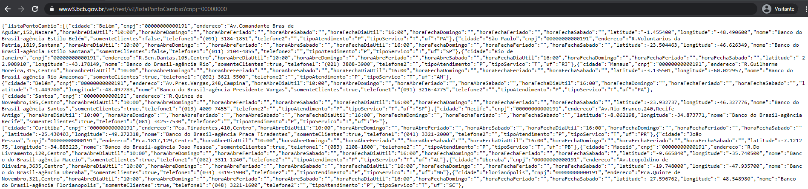

# Documentação | bot-casas-cambio 

<br><br/>

## 1. Introdução

O bot Casas de Câmbio foi desenvolvido para coletar dados disponíveis via API no portal: https://www.bcb.gov.br/

Os dados são fornecidos através de um único endereço:

* URL: 'https://www3.bcb.gov.br/vet/rest/v2/listaPontoCambio?cnpj=00000000'

O endereço retorna os dados em formato de dicionário, então são coletados e armazenados em arquivo JSON.

<br/>

Exemplo dos dados disponiveis na URL mencionada:


<br><br/>

## 2. Resultado do bot (Outputs)

O bot irá gerar dois arquivos no final da execução.

* _casasCambio.json: contém os dados de Casas de Cambio disponibilizados via API. Se trata de um dicionário, com uma lista de dados das Casas de Câmbio.
Obs.: O arquivo contém uma "string" padrão no nome, com data e hora de execução.

```json
{
   "listaPontoCambio":[
      {
         "cidade":"Belém",
         "cnpj":"00000000000191",
         "endereco":"Av.Comandante Bras de Aguiar,152,Nazare",
         "horaAbreDiaUtil":"10:00",
         "horaAbreDomingo":"",
         "horaAbreFeriado":"",
         "horaAbreSabado":"",
         "horaFechaDiaUtil":"16:00",
         "horaFechaDomingo":"",
         "horaFechaFeriado":"",
         "horaFechaSabado":"",
         "latitude":"-1.455400",
         "longitude":"-48.490600",
         "nome":"Banco do Brasil-agência Estilo Belém",
         "somenteClientes":false,
         "telefone1":"(091) 3184-1851",
         "telefone2":"",
         "tipoAtendimento":"P",
         "tipoServico":"T",
         "uf":"PA"
      }
   ]
}      
```

* casasCambio.log: contém informações de log e tempo de execução do bot.
Obs.: O arquivo contém uma "string" padrão no nome, com data e hora de execução.

```log
2021-05-25 13:49:46,119 - INFO - Conectado com sucesso no Bucket: bvs-bigdata-datalake-stage-external-cadastral-rf-dev
2021-05-25 13:49:46,602 - INFO - Download finalizado. URL: https://www3.bcb.gov.br/vet/rest/v2/listaPontoCambio?cnpj=00000000: 
2021-05-25 13:49:46,873 - INFO - Arquivo salvo no BUCKET: <Bucket: bvs-bigdata-datalake-stage-external-cadastral-rf-dev> e BLOB: <Blob: bvs-bigdata-datalake-stage-external-cadastral-rf-dev, datalake/stage/external/cadastral/rf/data/CASASCAMBIO/ partitions/monthly/2021/05/20210525_134945_casasCambio.json, 1621950586750864>
2021-05-25 13:49:46,874 - INFO - Aplicação finalizada. Tempo de execução: 1.833963394165039s
```

<br><br/>

## 3. Funcionalidades

* O bot acessa a URL fornecida para capturar os dados através de um comando GET na API.
* Valida a conexão com o bucket e projeto no GCP, em seguida cria o blob para o a sequência do trabalho.
* Realiza a leitura dos dados capturados e transfoma em texto.
* Aciona a função de upload para o GCP, que irá armazenar os dados em um arquivo JSON.
* Armazena o log de processamento/execução do bot, no mesmo bucket e blob do arquivo JSON

<br><br/>

## 4. Conteúdo

O bot é composto por quatro arquivos:

* bot_casacambio.py: programação python para download e upload de dados.
* gcp_connect.py: programação python para fornecer conexão com o GCP.
* bot_config.py: programação python para fornecer os parametros e as configurações do bot.
    * GCP project, Bucket and Blob;
    * Nome dos arquivos;
    * Parametros de requisição.
* Dockerfile: script Docker para construir o container da aplicação.